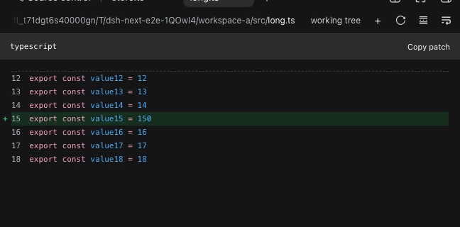
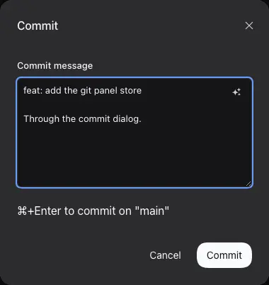
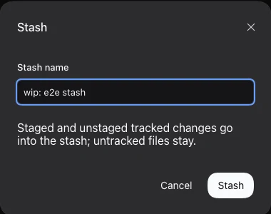
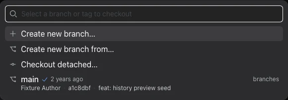
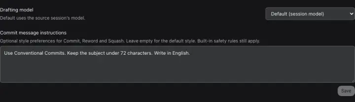
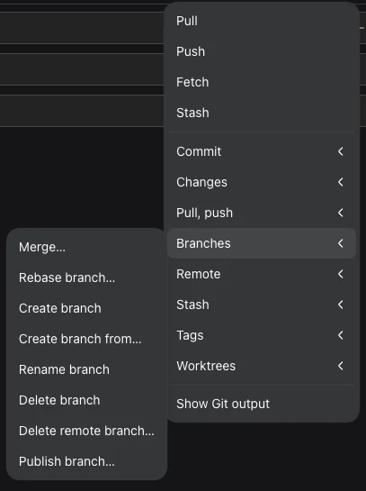
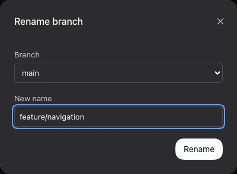

# 面向 DeepSeek Harness 的源代码管理

[English](README.md) | 中文

这个 DeepSeek Harness 插件在右侧边栏加入原生的**源代码管理**标签页：工作区更改、
差异、历史、分支与 git 工作树集中在一处，并让智能体成为一等公民的 git 协作方。
日常 git 操作无需离开图形界面。

## 使用方法

1. 打开右侧边栏的起始指南（罗盘标签页），选择 **源代码管理**，该标签页会就地打开。
2. 顶部显示当前分支，以及相对上游领先或落后多少提交。点击分支名会打开**检出选择器**：
   一个可筛选全部本地分支、远程分支与标签的搜索框，每行还显示该分支最新提交的作者、短哈希
   与主题，以及领先/落后和提交时间。选择本地分支即切换，选择远程分支会检出它的本地同名分支，
   选择标签则进入游离状态。列表顶部的操作可以基于当前 HEAD 或所选基点新建分支，或进入游离检出列表。
   分支名前的 `Sync` 图标打开现有同步弹窗供检查和确认；仅点击快捷图标不会拉取或推送。
   底部输入框的控制行也会显示同一个分支，因此可以在发送第一条消息前就选好要工作的分支。
3. 先暂存内容，然后在**更改**标题栏点击**提交**或**贮藏**——两者在索引中没有内容时都不可用，
   并且各自打开一个小弹窗。**提交**弹窗只有一个多行 `Commit message` 输入框：第一行写摘要，
   空一行后可填写详情。输入框内右上角的星光按钮根据已暂存的更改生成并替换整条消息；
   生成失败或取消时，原有文本保持不变。按 `Cmd`/`Ctrl` + `Enter` 提交；**贮藏**弹窗用于输入名称。
4. 在**更改**中点击任意一行查看差异；悬停该行可看到**暂存**、**取消暂存**和**放弃更改**，
   也可以用分区标题栏批量暂存、取消暂存或放弃全部更改。各分区默认折叠：点击分区标题栏即可展开并折叠其他分区，再次点击折叠。
5. 在**工作树**中先用起点按钮选择新副本的检出内容：基于基线新建
   `dsh-git/<名称>` 分支，或检出已有分支、远程分支、标签——这里使用的是与顶部
   分支名相同的选择器，同样可筛选并显示提交详情。点击**创建**即可在本仓库内
   得到位于 `.worktrees/<名称>` 的副本。如果项目声明了创建时的操作，会先弹出确认框，
   逐条列出确切的命令与路径并分别询问；未勾选的内容既不会执行也不会复制。下方的按钮
   用于选择所有行共同对比的**基线**；点击某行的文件夹图标会在该副本中打开会话。
6. 在**历史**中浏览当前检出的最近提交。单击提交即可选择（无需修饰键），再从工具栏选择命令：
   **Inspect**、**Compare**、**Squash**、**Fixup**、**Reorder**、**Reword**、
   **Cherry-pick** 或 **Revert**。每条命令都会打开自己的小弹窗，在按下按钮前展示它将要执行的内容。
   每行还带有 `Check out commit` 图标。使用 `Load more` 查看更早的提交，
   使用侧栏顶部的分支选择器切换分支。
7. 冲突文件会打开冲突编辑器：基线、当前与传入三个版本与结果并排显示，可逐块选择，
   先**保存**再显式**标记为已解决**。被中断的合并、变基、拣选或还原会显示横幅，提供
   **继续**、**跳过此步骤**与**中止**。

## 功能

**带真实差异的更改。** 已暂存、未暂存和未跟踪的文件分开列出，冲突会单独标注。
差异使用平台自带的差异组件渲染；超过大小上限的文件会退化为行数统计加可复制的补丁，
而不是铺满整屏的文本。


点击任一更改的文件会在独立标签页中打开，标签页带有与面板相同的分支图标，界面与文件系统预览一致。默认只显示更改：
每处更改的行会被标记，并在上下各保留三行上下文，其余未更改的部分折叠在虚线之后，
因此行号仍与文件本身一致。工具栏提供「仅更改行 / 整个文件」切换、自动换行开关、
**刷新**（重新读取文件），以及可就地暂存或取消暂存该文件各代码块的 `+`/`−` 操作。
文件行只保留暂存、取消暂存与放弃更改操作；点击文件行即可在预览标签页中查看更改。







**统一的分支选择器。** 顶部的分支名打开的不是下拉菜单，而是带搜索框的选择面板：
按本地分支、远程分支、标签分组，每行同时显示该分支最新提交的作者、短哈希与主题，
以及领先/落后与提交时间。输入内容即可按名称、最近改动内容或提交哈希筛选。
顶部操作可基于当前 HEAD 或所选基点新建分支，或进入游离检出列表；选择标签会进入游离状态，
选择已有本地同名分支的远程分支则视为已在该分支，而不会报错。工作树的起点按钮使用同一个选择器。



**会话开始时所在的分支。** 输入框的控制行会在附件、权限与模型控件旁显示当前会话的分支。
它与面板标题栏使用同一个分支控件和同一个选择器，因此可以在发送第一条消息前选择甚至新建分支，
新会话不会在错误的分支上悄悄开始。若工作区不是 git 仓库，这里不会显示任何内容：
该控件是对输入框的补充，而不是输入框的一种状态。输入框较窄时它只保留分支图标与下拉箭头，与旁边的权限控件一样收起文字。


**两个写操作位于「更改」标题栏。** **提交**与**贮藏**紧邻标题栏的暂存操作，只有在索引
中有已暂存的内容时才可用，因此不会在空索引或存在冲突时执行；悬停不可用的按钮会说明原因。
提交弹窗使用一个多行消息框——第一行摘要，之后可选详情，与 git 的读法一致；
贮藏弹窗为保存的内容命名。

**按影响范围分级的安全约束。** 暂存、取消暂存和提交立即执行。任何可能丢失工作的操作
——放弃更改、删除工作树、切换或删除分支、合并、检出提交——都会先确认、
列出受影响的文件，并在 git 无法安全执行时（工作区有未提交更改、有操作正在进行、
HEAD 处于游离状态）直接拒绝。

**卡住时也能恢复。** 正在进行的合并、变基、拣选或还原会显示独立横幅，提供**继续**、
**跳过此步骤**（存在可跳过步骤的操作，且需先确认）与**中止**，冲突不再是死路。
冲突路径可打开真正的冲突编辑器：基线、当前与传入版本与结果并排显示，支持逐块选择，
草稿在仓库变化后仍会保留，**标记为已解决**只暂存你保存的内容。插件遵循 Git 自身的
`conflict-marker-size` 属性；无法用原始文本编辑器如实表达的工作流（自定义
`working-tree-encoding`、Git filter、子模块、超大文件）会给出原因并拒绝，而不是悄悄改写。


**看得懂的工作树。** 每一行以 git 报告的分支命名——已有分支、远程分支、标签（游离），
或从你选择的起点新建的 `dsh-git/<名称>` 分支。所有行统一与**一个可见的基线**比较
（默认是仓库的默认分支，可随时切换），因此"领先 3"始终说明了基准；行内显示文件夹路径、
干净或有改动、领先、落后、已合并、已锁定与可清理等状态。每行都可以在该文件夹中打开会话、
从基线更新、合并到当前检出、解锁或删除；文件夹丢失的工作树可以一键清理。工作树位于仓库内的
`.worktrees/<名称>`，并通过 `.git/info/exclude` 隐藏——绝不会写入你提交的
`.gitignore`。`.worktrees.json` 可运行创建时的安装命令（例如 `pnpm install`），
`.worktreeinclude` 会复制新检出所需的未跟踪文件（`.env`、本地配置）。通过此面板成功创建的
工作树也会注册到左侧工作区侧栏，但不会打开会话或切换当前会话。发现或刷新已有工作树时
不会自动注册；需要打开时请点击其文件夹图标。通过面板删除工作树时，Git 操作成功后也会
移除对应的侧栏工作区条目，已保存的会话会保留。


**可分步操作的历史。** 有深度上限的图形列按从新到旧显示当前检出的最近提交。每行显示标题、
短哈希、作者与引用；`Check out commit` 在悬停或键盘聚焦时出现，在触屏设备上
始终显示。单击提交即累加选择，每条命令都有自己的小弹窗，而不是一个拥挤的工作区：

- **Inspect** 查看单个提交：左侧是所选文件的差异，右侧是该提交更改的文件列表，使用与更改区
  相同的差异组件渲染。多选时可在顶部切换要查看的提交。
- **Compare** 在两个所选提交之间显示逐文件的差异。
- **Squash** 与 **Reword** 提供 **Summary** 和 **Description** 字段，预填完整提交信息。
  星光图标根据所选提交起草信息，而不是根据暂存的更改。点击一次即可直接替换两个字段，
  不打开第二个弹窗，也无需确认。执行历史操作前，请检查并按需编辑生成的内容。
- **Fixup**、**Reorder**、**Cherry-pick** 与 **Revert** 显示简洁的提交列表和一个操作按钮；
  `Reorder` 另有移动控件。简短的确认保护可能已共享的历史。错误详情始终显示在红色边框区域中，不提供重试按钮，
  常规实现细节不会占满弹窗。

当前选择无法执行的命令会被禁用，并在悬停时说明原因。被中断的操作可在同一弹窗中通过
**继续**、**跳过**、**中止**与**还原备份**恢复。提交列表只会在展开历史折叠区时加载，
并且仅在该区域可见时重新读取；从差异视图返回时，会重新加载已展开的历史区域。其他可见的
面板数据仍会在打开面板、窗口获得焦点以及智能体结束一轮对话后刷新。


**让智能体参与协作。** 审查更改、解释差异、起草提交信息和解决冲突会先让你选择
**当前会话**或**新会话**，发送前可查看文件列表、检出、分支和确切的提示内容。
疑似敏感的文件默认不包含，除非主动勾选。这些基于文件的提示有大小预算并说明省略的内容；
只有仓库状态没有变化时才能采用返回的草稿。Commit、Squash 和 Reword 内的星光按钮
则直接生成文本，不启动智能体对话轮次。

**起草模型。** 打开 **Plugins**，选择 `next-git`，然后设置 `Drafting model`。
`Default (session model)` 使用来源会话所选的模型；未选择时使用 Harness 默认模型。
此设置不会更改聊天模型。
下方的 `Commit message instructions` 可填写适用于 Commit、Reword 和 Squash 的写作偏好
（最多 4,000 个字符），例如：“使用 Conventional Commits 格式，主题不超过 72 个字符”。
点击 `Save` 应用；清空并保存即可恢复默认风格。这些偏好补充而非替换内置的事实依据
和安全规则，不影响其他智能体操作。



**仓库操作。** 点击标题栏最右侧的三点按钮即可打开嵌套菜单：

- `Commit`：提交已暂存内容或全部更改、修订、签署声明、撤销最后一次提交，或中止变基。
- `Changes`：暂存、取消暂存或放弃所有更改。
- `Pull, push`：同步、拉取（包括变基）、选择远程仓库、普通或带租约强制推送、获取并清理，以及获取所有远程仓库。
- `Branches`：合并、变基、从指定起点创建、重命名、删除本地或远程分支，以及发布分支。
- `Remote`：添加或移除远程仓库。
- `Stash`：保存已跟踪、未跟踪或已暂存内容，应用或弹出所选或最新贮藏，丢弃一个或全部贮藏，以及查看补丁。
- `Tags`：创建轻量或附注标签、删除本地或远程标签，以及推送标签。
- `Worktrees`：通过现有工作树控件创建或管理检出。

顶层快捷命令为 `Pull`、`Push`、`Fetch` 和 `Stash`。
选择命令后会打开小弹窗：标签位于对齐的字段上方，只有一个紧凑的操作按钮，
没有标签页、仓库标题或 Refresh/Cancel 底栏。点击 × 或按 Escape 关闭，重新打开时会读取最新选项。
破坏性命令需要确认；强制推送使用显式租约，如果远程分支尖端已改变则拒绝执行。
普通拉取和同步仅允许快进；历史分叉时请选择 `Pull (rebase)`。
撤销提交后其更改仍保持暂存。弹出贮藏仅在成功应用后才移除条目，发生冲突时保留。
`Show Git output` 显示有长度限制的命令结果摘要，而不是可能包含凭据的原始 Git 输出。
可执行过滤器、自定义合并驱动和特殊贮藏引用存储可能需要使用终端，插件不会绕过安全检查。





**如实呈现的失败状态。** 未找到 git、git 版本过低、不是仓库、裸仓库、权限被拒绝、
缺少提交身份、另一个 git 进程占用 `index.lock`，每一种都有具名状态与修复提示，
而不是直接抛出 stderr。本会话的智能体会在同一仓库中运行 git，因此写操作按仓库串行，
锁冲突会自动重试。面板也不会一片空白：读取中、没有会话的标签页、渲染失败都会说明
情况，渲染失败会被就地接住并可重试，而不会让标签页失效。

## 安装

```sh
dsh plugin --profile <name> add @dsh-next/dsh-next-git
```

`<name>` 是你的 DSH profile（例如 `web`）。

## 使用前须知

- 需要 git 2.31 或更高版本。没有 git 或不在仓库中时，标签页会说明该怎么做，而不是打不开。
- Harness 重启后恢复的标签页可能会在该会话重新载入之前打开。源代码管理会在后台持续读取，
  会话打开后自动恢复；等待期间会说明会话尚未打开，而不会声称该文件夹不是仓库。
- 可以在文件差异中按块暂存或取消暂存，无法精确表达某一块时会退回整文件操作。
- 历史改写会先规划、预览并记录日志，拒绝合并提交、不连续的选区等无法精确重放的拓扑。
  改写已发布的历史需要显式确认，插件也绝不会替你推送。
- **Squash**、**Fixup** 与 **Reword** 不会修改已暂存、未暂存或未跟踪的工作，无需贮藏。
  它们只改写提交历史，不检出文件。作者与日期保持不变，旧提交签名会被移除；
  后继提交会获得新的提交 ID，插件不会推送。
- **Reorder**、**Cherry-pick**、**Revert** 和 **Restore backup** 仍需完全干净的检出。
  所有历史命令都会拒绝正在进行的 Git 操作。命令运行时请勿同时编辑历史或切换分支。
- 安装命令与文件复制都是每次创建时的独立决定：插件绝不会自行运行 `.worktrees.json`
  或复制 `.worktreeinclude`，复制也不会跟随符号链接或覆盖已存在的文件。
- 工作树会话中，skills 与 Claude 插件的作用域继承不属于本插件的范围。
- 贡献者请看 [CONTRIBUTING.md](https://github.com/dsh-next/dsh-next-plugins/blob/main/CONTRIBUTING.md)。
