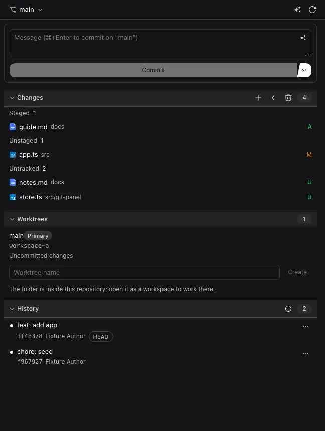
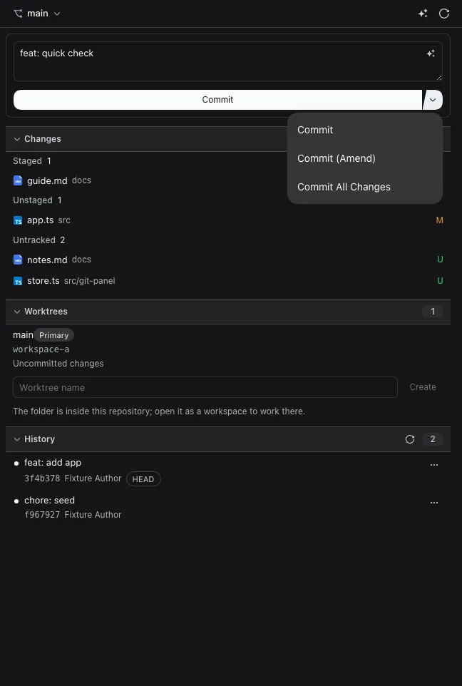
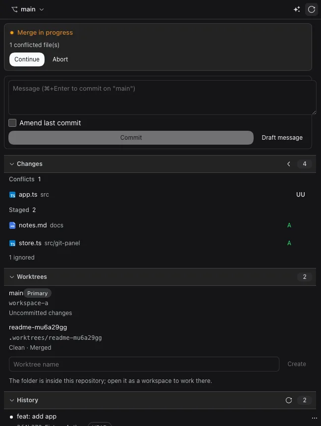
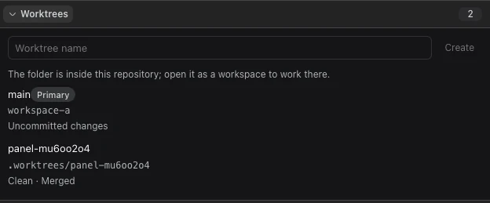
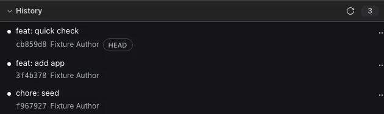

# 面向 DeepSeek Harness 的源代码管理

[English](README.md) | 中文

这个 DeepSeek Harness 插件在右侧边栏加入原生的**源代码管理**标签页：工作区更改、
差异、历史、分支与 git 工作树集中在一处，并让智能体成为一等公民的 git 协作方。
日常 git 操作无需离开图形界面。

## 使用方法

1. 打开右侧边栏的起始指南（罗盘标签页），选择 **源代码管理**，该标签页会就地打开。
2. 顶部显示当前分支，以及相对上游领先或落后多少提交。点击分支名即可切换分支。
3. 输入提交信息，或在信息框右上角点击生成图标让插件根据更改列表生成，然后在信息框中按
   `Cmd`/`Ctrl` + `Enter` 或点击**提交**。**提交**旁的箭头还提供**提交（修补）**与
   **提交全部更改**（会先暂存全部更改）。每个 AI 操作都会先询问在哪里执行：**当前会话**
   或**新会话**；发送前会展示实际的提示内容。
4. 在**更改**中点击任意一行查看差异；悬停该行可看到**暂存**、**取消暂存**和**放弃更改**，
   也可以用分区标题栏批量暂存、取消暂存或放弃全部更改。各分区默认折叠：点击分区标题即可展开，再次点击折叠。
5. 在**工作树**中先用起点按钮选择新副本的检出内容：基于基线新建
   `dsh-git/<名称>` 分支，或检出已有分支、远程分支、标签。点击**创建**即可在本仓库内
   得到位于 `.worktrees/<名称>` 的副本。如果项目声明了创建时的操作，会先弹出确认框，
   逐条列出确切的命令与路径并分别询问；未勾选的内容既不会执行也不会复制。下方的按钮
   用于选择所有行共同对比的**基线**；点击某行的文件夹图标会在该副本中打开会话。
6. 在**历史**中勾选提交来规划操作：**压缩**、**修正**、**重排**、**改写信息**、
   **拣选**或**还原**。执行前会先显示计划并提示已发布的历史；每次改写都会保留备份引用
   与可回退的日志。单个提交的 `⋯` 菜单仍提供复制哈希、检出、还原与拣选。
7. 冲突文件会打开冲突编辑器：基线、当前与传入三个版本与结果并排显示，可逐块选择，
   先**保存**再显式**标记为已解决**。被中断的合并、变基、拣选或还原会显示横幅，提供
   **继续**、**跳过此步骤**与**中止**。

## 功能

**带真实差异的更改。** 已暂存、未暂存和未跟踪的文件分开列出，冲突会单独标注。
差异使用平台自带的差异组件渲染；超过大小上限的文件会退化为行数统计加可复制的补丁，
而不是铺满整屏的文本。





**按影响范围分级的安全约束。** 暂存、取消暂存和提交立即执行。任何可能丢失工作的操作
——放弃更改、删除工作树、切换或删除分支、合并、检出提交、还原、拣选——都会先确认、
列出受影响的文件，并在 git 无法安全执行时（工作区有未提交更改、有操作正在进行、
HEAD 处于游离状态）直接拒绝。

**卡住时也能恢复。** 正在进行的合并、变基、拣选或还原会显示独立横幅，提供**继续**、
**跳过此步骤**（存在可跳过步骤的操作，且需先确认）与**中止**，冲突不再是死路。
冲突路径可打开真正的冲突编辑器：基线、当前与传入版本与结果并排显示，支持逐块选择，
草稿在仓库变化后仍会保留，**标记为已解决**只暂存你保存的内容。插件遵循 Git 自身的
`conflict-marker-size` 属性；无法用原始文本编辑器如实表达的工作流（自定义
`working-tree-encoding`、Git filter、子模块、超大文件）会给出原因并拒绝，而不是悄悄改写。



**看得懂的工作树。** 每一行以 git 报告的分支命名——已有分支、远程分支、标签（游离），
或从你选择的起点新建的 `dsh-git/<名称>` 分支。所有行统一与**一个可见的基线**比较
（默认是仓库的默认分支，可随时切换），因此"领先 3"始终说明了基准；行内显示文件夹路径、
干净或有改动、领先、落后、已合并、已锁定与可清理等状态。每行都可以在该文件夹中打开会话、
从基线更新、合并到当前检出、解锁或删除；文件夹丢失的工作树可以一键清理。工作树位于仓库内的
`.worktrees/<名称>`，并通过 `.git/info/exclude` 隐藏——绝不会写入你提交的
`.gitignore`。`.worktrees.json` 可运行创建时的安装命令（例如 `pnpm install`），
`.worktreeinclude` 会复制新检出所需的未跟踪文件（`.env`、本地配置）。



**可操作的历史。** 有深度上限的图形列，支持搜索、作者与日期筛选，支持多选（单击、
`Shift`+单击、键盘），并可基于选择规划**压缩**、**修正**、**重排**、**改写信息**、
**拣选**与**还原**。计划会先预览；改写会拒绝无法精确重放的拓扑，历史已发布时需要
显式确认，并保留日志与 `refs/dsh/history-backups/*`，因此已完成或被中断的操作可以
继续、跳过、中止或还原。刷新会在打开、窗口获得焦点以及智能体结束一轮对话时重新读取。



**让智能体参与协作。** 审查更改、解释差异、起草提交信息、解决冲突，以及历史与冲突
相关操作，都会先打开同一个选择器：发送到**当前会话**或新建**新会话**，并在提交前显示
文件列表（或提交数量）、检出与分支以及确切的提示内容。疑似敏感的文件默认不包含，除非
你主动勾选；内容会按提示预算截断并始终说明省略了多少；只有在仓库自提问以来没有变化时，
返回的结果才可以作为提交信息使用。

**仓库操作。** 一个用于非工作区编辑类操作的界面：拉取（可清理）、推送当前分支、
暂存与恢复 stash，以及新建、重命名或删除分支。每项操作都会先预览将要执行的内容与将要
拉取、推送或丢弃的内容；非快进推送或删除未合并分支需要再次显式确认。

**如实呈现的失败状态。** 未找到 git、git 版本过低、不是仓库、裸仓库、权限被拒绝、
缺少提交身份、另一个 git 进程占用 `index.lock`，每一种都有具名状态与修复提示，
而不是直接抛出 stderr。本会话的智能体会在同一仓库中运行 git，因此写操作按仓库串行，
锁冲突会自动重试。面板也不会一片空白：读取中、没有会话的标签页、渲染失败都会说明
情况，渲染失败会被就地接住并可重试，而不会让标签页失效。

## 安装

```sh
dsh plugin --profile <name> add @dsh-next/dsh-next-git
```

`<name>` 是你的 DSH profile（例如 `web`）。

## 使用前须知

- 需要 git 2.31 或更高版本。没有 git 或不在仓库中时，标签页会说明该怎么做，而不是打不开。
- 可以在文件差异中按块暂存或取消暂存，无法精确表达某一块时会退回整文件操作。
- 历史改写（压缩、修正、重排、改写信息）会先规划、预览并记录日志，拒绝合并提交、
  不连续的选区等无法精确重放的拓扑。改写已发布的历史需要显式确认，插件不会替你推送。
- 安装命令与文件复制都是每次创建时的独立决定：插件绝不会自行运行 `.worktrees.json`
  或复制 `.worktreeinclude`，复制也不会跟随符号链接或覆盖已存在的文件。
- 工作树会话中，skills 与 Claude 插件的作用域继承不属于本插件的范围。
- 贡献者请看 [CONTRIBUTING.md](https://github.com/dsh-next/dsh-next-plugins/blob/main/CONTRIBUTING.md)。
