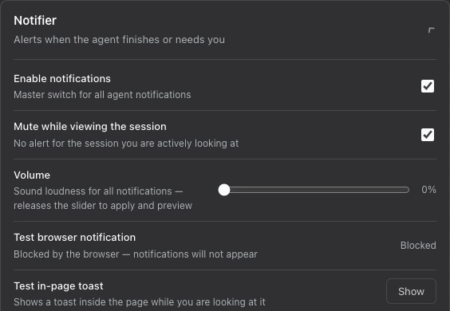

# dsh-next-notifier

English | [中文](README.zh.md)

A DeepSeek Harness plugin that uses in-page toasts, browser notifications, and optional sounds to tell you when an agent finishes, stops with a problem, or needs your input.

## How to use it

1. Install the plugin using the command below, then open the Web GUI for that profile.
2. Open `Settings` → `Plugins` and expand `Notifier`. Keep `Enable notifications` on and choose which categories and sounds you want.
3. Beside `Test in-page toast`, click `Show`. For background alerts, click `Enable` beside `Test browser notification`, allow browser permission, then click `Test`.
4. Start a task and switch to another session or background the window. `Mute while viewing the session` is on by default, so real alerts stay quiet while you are looking at the session that triggered them.
5. Click an alert to open its session. Dismiss a toast with its close button (also keyboard-accessible), or let it disappear after 12 seconds.



## Features

### Alerts that explain what happened

Main-agent alerts distinguish `Agent finished`, `Agent error`, `Agent blocked`, and `Agent reached token limit`. Cancelled or interrupted turns stay quiet. Terminal alerts wait for a two-second idle period; a resumed or disposed agent cancels its pending alert.

`Approval needed` and `Question asked` mean a human response is still pending, not merely that a tool was called. Requests that settle within 200 ms stay quiet, and pending alerts are withdrawn when the request settles or is aborted.

Enable `Subagent finished` to receive child-run terminal alerts; it is off by default, and child status changes do not masquerade as main-agent finishes. `Only notify when the goal completes` is on by default: while a goal is active and armed to continue, it suppresses ordinary finishes, not errors. Goal completion or blocking produces one goal alert rather than a duplicate turn-finished alert.

### One delivery owner across tabs

A visible, focused page shows an in-page toast without browser permission. Otherwise, a background page with permission can show a browser notification. Multiple open clients coordinate delivery so one client owns each alert at a time; a focused page is preferred.

If background browser notifications are unavailable or permission is not granted, an alert can wait up to 120 seconds for a foreground toast while a page remains alive. There is no offline inbox: events with no open client are dropped, and closing every page does not preserve pending alerts for next time.

### Sound only with acknowledged delivery

Automatic sound starts only after a visible toast is rendered or the browser reports that a notification was shown. Browser notifications request silent native playback to avoid a second sound. Browser acknowledgement cannot prove a desktop banner was actually presented: OS notification settings or Do Not Disturb may suppress it outside the browser API’s visibility.

Sounds play on the machine running DSH, using `afplay` on macOS, PowerShell `Media.SoundPlayer` on Windows, or `paplay` / `aplay` on Linux. A remote DSH host does not play these sounds on your browser’s device.

### Choose your sound

The `Agent finished`, `Approval needed`, and `Question asked` categories each have an enable switch, `Play sound`, and a `Sound` selector. Selecting a sound saves and previews it. `Volume` ranges from 0–100; after you stop adjusting it for 600 ms, the latest value is saved and previewed. Save and preview failures appear in the card. `Show details` displays the detected sound player and focus-tracking status.

The library contains 17 synthesized sounds; no audio download is needed.

| Group | Sounds |
| --- | --- |
| Chimes | `Chime`, `Ping`, `Bell` |
| Alerts | `Alert`, `Error`, `Success` |
| Effects | `Chirp`, `Pop`, `Knock`, `Whoosh`, `Magic`, `Blip`, `Ring`, `Gong` |
| Farts | `Fart · Classic`, `Fart · Deep`, `Fart · Squeaky` |

Defaults: finished = `Chime`, approval = `Ping`, question = `Chirp`.

## Install

```sh
dsh plugin --profile <name> add @dsh-next/dsh-next-notifier
```

Replace `<name>` with your DSH profile, for example `web`, and open DSH using the same profile.

## Good to know

- This plugin is for the DSH Web GUI; the declared DSH minimum is `0.1.1-rc.1`. Keep a page open to receive alerts.
- Missing an alert? Check `Enable notifications`, the category switch, `Mute while viewing the session`, browser permission, and OS notification settings. Missing sound? Check `Play sound`, `Volume`, and the sound player under `Show details`.
- Windows playback has contract-test coverage only; live Windows playback still needs verification. Browser test buttons do not guarantee OS banner presentation.
- For local development and validation, see [CONTRIBUTING.md](https://github.com/dsh-next/dsh-next-plugins/blob/main/CONTRIBUTING.md).
