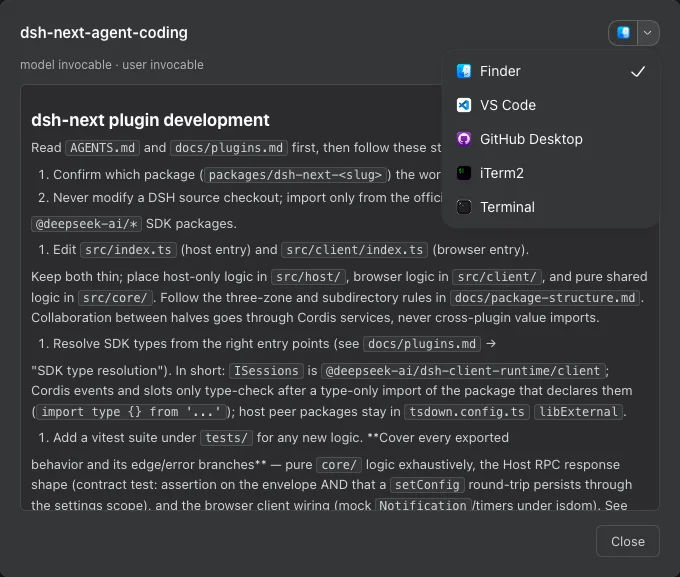

# @dsh-next/dsh-next-skills

English | [中文](README.zh.md)

A DeepSeek Harness plugin that lets you browse GitHub skill catalogs and install, update, and remove global agent skills from the Web GUI.

## How to use it

1. Install the plugin below, open the DSH Web GUI, and go to settings → `Skills`.
2. Wait for the default providers to sync, or open `Providers` and add a public GitHub repository such as `owner/repo` or `https://github.com/owner/repo`.
3. In `Skills`, search for a skill and click its name to read the full `SKILL.md`. Use the provider filter or `Installed only` to narrow the list.
4. Click `Install`. Files go directly into your global agents skill root (normally `~/.agents/skills/<name>/`), with no scope picker. DSH discovers them natively for use across workspaces, subject to their frontmatter invocation flags.
5. Use `Refresh all` in `Providers` to check for changes, then `Update` on an installed copy to apply its provider’s version.

## Features

### Browse and manage global copies

The `Skills` tab combines installed skills from the global DSH and agents roots
(normally `~/.dsh/skills` and `~/.agents/skills`) with uninstalled provider skills.
Search ranks name matches first; `Show more` reveals 30 more cards. Each installed
copy has its own card and origin label, so copies with the same name stay distinct.
Project skills are not listed or managed here.


### Open a skill’s folder

Click an installed skill’s name, then use the app icon beside the modal title to
open that copy’s folder. The arrow lists supported apps detected by DSH, such as
Finder or VS Code. Your choice is remembered for skill dialogs in this browser;
flat Markdown skills open their containing folder.

The control is hidden while apps load, when no supported apps are available,
when DSH’s native opener is unavailable, and for uninstalled catalog skills.
Launch failures leave the modal open so you can retry. Apps open on the machine
running DSH, which may differ from the browser’s machine in remote deployments.



### Choose a provider and update deliberately

`Update` uses only the copy’s recorded provider; another provider’s same-name skill
is never treated as its update. `Providers` shows alternative sources and whether
they match your copy. Switching providers requires an overwrite confirmation.
Updates and provider switches rewrite the copy in place and permanently remove
files absent from the provider version, including local additions; those files
do not go to trash. Choose `Local (hand-managed)` to detach without changing files
and stop provider updates.

### Refresh catalogs without replacing installed copies

Providers can be public GitHub repositories with `SKILL.md` directories at any
depth; `.git`, `.github`, and `node_modules` are skipped. Default providers are
added on first launch and synced shortly after boot; removing one persists.
`Refresh all` syncs providers one at a time, showing progress and per-provider
errors while continuing past failures. The catalog cache under
`$DSH_HOME/skills-market/` does not activate skills by itself. Refresh detects
changes without overwriting existing copies; missing recorded installs are
restored as described below.

### Recover deletions and restore missing installs

`Delete` moves a global copy into its root’s `.trash` directory for manual recovery,
including hand-managed copies. Removing the last copy of a name also removes its
installation record. Providers and the `installations` provenance ledger live in
`$DSH_HOME/settings.yaml` under `dsh-next-skills`. After boot-time provider sync
and each `Refresh all`, reconciliation restores missing global agents-root
install directories from the available provider cache; it does not overwrite
existing directories. Sharing that settings section can therefore recreate
recorded provider installs on another machine after sync. A failed provider can
be retried with `Refresh all`; deleting files by hand while keeping their record
may cause them to be reinstalled.

### Keep Claude plugin skills with their owner

Skills installed through `Claude Plugins` remain owned by that plugin: update or
uninstall them there, rather than switching providers or deleting them here.
Their skill files install globally and are available independently of the Claude
plugin’s scope, still subject to frontmatter invocation flags. Workspace-scoped
plugins containing skills receive a nonfatal warning; Claude plugin and MCP
scope behavior is otherwise unchanged.

## Install

```sh
dsh plugin --profile <name> add @dsh-next/dsh-next-skills
```

`<name>` is your DSH profile, for example `web`.

## Good to know

- Requires DeepSeek Harness `>=0.1.1-rc.1`. DSH’s native filesystem discovery handles skill visibility and precedence; this plugin does not override discovered skills or their invocation flags. `disable-model-invocation` and `user-invocable` in skill frontmatter still apply.
- Upgrading preserves existing skill files, providers, and the installation ledger. Legacy `dsh-next-skills.scopes` settings are ignored and dropped on the next plugin settings save: previously disabled or workspace-restricted global skills become globally available, subject to frontmatter invocation flags. There are no per-skill scope or enable/disable controls. This alpha makes a clean interface break: install requests no longer interpret or validate scope fields; every install is global.
- If you use `@dsh-next/dsh-next-cc-plugins`, upgrade both plugins together. A new Claude bridge paired with an older scoped Skills plugin can retain legacy skill restrictions; changing the Claude plugin’s scope no longer manages those restrictions.
- No project copies are automatically moved or deleted. Existing `.agents/skills/` and `.dsh/skills/` copies in projects remain hand-managed and follow native DSH discovery.
- If GitHub metadata requests hit rate limits, set `DSH_GITHUB_TOKEN` or `GITHUB_TOKEN` in the DSH process environment and refresh again.
- For development and testing, see [CONTRIBUTING.md](https://github.com/dsh-next/dsh-next-plugins/blob/main/CONTRIBUTING.md).
