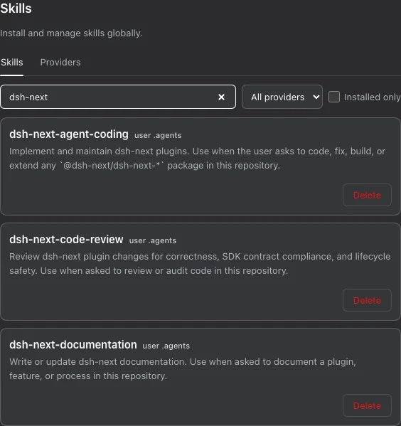

# @dsh-next/dsh-next-skills

[English](README.md) | 中文

一个 DeepSeek Harness 插件，让你从 Web GUI 浏览 GitHub 技能目录，并安装、更新和移除全局 agent 技能。

## 使用方法

1. 按下方说明安装插件，打开 DSH Web GUI，进入设置 → `Skills`。
2. 等待默认提供方同步，或打开 `Providers`，添加公开 GitHub 仓库，例如 `owner/repo` 或 `https://github.com/owner/repo`。
3. 在 `Skills` 中搜索技能，点击名称阅读完整的 `SKILL.md`。使用提供方筛选或 `Installed only` 缩小列表范围。
4. 点击 `Install`。文件直接写入全局 agents 技能根目录（通常为 `~/.agents/skills/<name>/`），无需选择作用域。DSH 原生发现这些技能，供各工作区使用，但仍遵循 frontmatter 调用标志。
5. 在 `Providers` 中使用 `Refresh all` 检查变更，再点击已安装副本上的 `Update` 应用其提供方版本。

## 功能

### 浏览和管理全局副本

`Skills` 标签页汇集全局 DSH 和 agents 根目录（通常为 `~/.dsh/skills` 和
`~/.agents/skills`）中的已安装技能，以及提供方尚未安装的技能。搜索优先显示
名称匹配项；`Show more` 每次再显示 30 张卡片。每个已安装副本都有独立卡片
和来源标签，因此同名副本仍可区分。此处不列出或管理项目技能。



### 选择提供方并主动更新

`Update` 只使用副本记录的提供方；其他提供方的同名技能不会被视为其更新。
`Providers` 显示其他来源及其内容是否与你的副本一致。切换提供方需要确认覆盖。
更新和切换提供方都会就地重写副本，并永久移除提供方版本中不存在的文件，包括
本地新增文件；这些文件不会进入回收站。选择 `Local (hand-managed)` 可在不
改动文件的情况下解绑，停止提供方更新。

### 刷新目录而不替换已安装副本

提供方可以是任意包含 `SKILL.md` 目录的公开 GitHub 仓库，目录深度不限；
`.git`、`.github` 和 `node_modules` 会被跳过。首次启动会添加默认提供方，
并在启动后不久同步；移除提供方会持久生效。`Refresh all` 逐个同步提供方，
显示进度和各提供方的错误，遇到失败仍会继续。`$DSH_HOME/skills-market/`
下的目录缓存不会自行激活技能。刷新只检测变更，不覆盖现有副本；缺失的已记录
安装会按下文所述恢复。

### 恢复删除和缺失的安装

`Delete` 将全局副本移入其根目录的 `.trash`，便于手动恢复，手工管理的副本
也适用。删除某个名称的最后一个副本时，也会删除其安装记录。提供方和
`installations` 来源记录保存在 `$DSH_HOME/settings.yaml` 的
`dsh-next-skills` 小节中。启动时的提供方同步和每次 `Refresh all` 之后，
协调恢复会从可用的提供方缓存中还原全局 agents 根目录下缺失的安装目录，不会
覆盖现有目录。因此，共享该设置小节可在另一台机器同步后重建已记录的提供方
安装。提供方同步失败后可用 `Refresh all` 重试；手动删除文件却保留安装记录，
可能导致文件被重新安装。

### 由所属 Claude 插件管理其技能

通过 `Claude Plugins` 安装的技能仍归该插件所有：请在那里更新或卸载，而不是
在这里切换提供方或删除。技能文件全局安装，其可用性不受 Claude 插件作用域
限制，但仍遵循 frontmatter 调用标志。包含技能的工作区作用域插件会收到不阻止
操作的警告；除此之外，Claude 插件和 MCP 的作用域行为保持不变。

## 安装

```sh
dsh plugin --profile <name> add @dsh-next/dsh-next-skills
```

`<name>` 是你的 DSH profile，例如 `web`。

## 使用须知

- 需要 DeepSeek Harness `>=0.1.1-rc.1`。技能的可见性和优先级由 DSH 原生文件系统发现处理；本插件不会覆盖发现的技能或其调用标志。技能 frontmatter 中的 `disable-model-invocation` 和 `user-invocable` 仍然有效。
- 升级会保留现有技能文件、提供方和安装记录。旧版 `dsh-next-skills.scopes` 设置会被忽略，并在下次保存插件设置时移除：此前停用或限制在部分工作区的全局技能将全局可用，但仍遵循 frontmatter 调用标志。不再提供逐技能的作用域或启用/停用控件。本 alpha 版本直接切换到新接口：安装请求不再解析或校验作用域字段，所有安装均为全局安装。
- 如果使用 `@dsh-next/dsh-next-cc-plugins`，请同时升级两个插件。新的 Claude 桥接与仍支持作用域的旧版 Skills 插件搭配时，可能保留旧的技能限制；更改 Claude 插件作用域已不再管理这些限制。
- 不会自动移动或删除任何项目副本。项目中现有的 `.agents/skills/` 和 `.dsh/skills/` 副本仍由项目手工管理，并遵循 DSH 原生发现规则。
- 如果 GitHub 元数据请求触及速率限制，请在 DSH 进程环境中设置 `DSH_GITHUB_TOKEN` 或 `GITHUB_TOKEN`，然后再次刷新。
- 开发和测试请参阅 [CONTRIBUTING.md](https://github.com/dsh-next/dsh-next-plugins/blob/main/CONTRIBUTING.md)。
