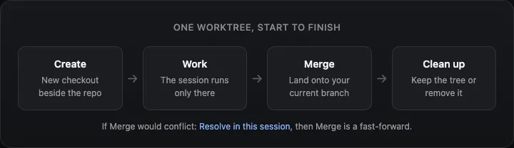
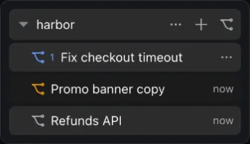
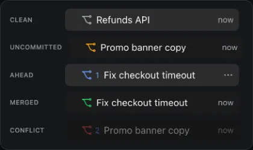
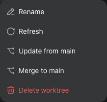
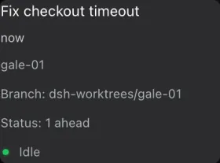
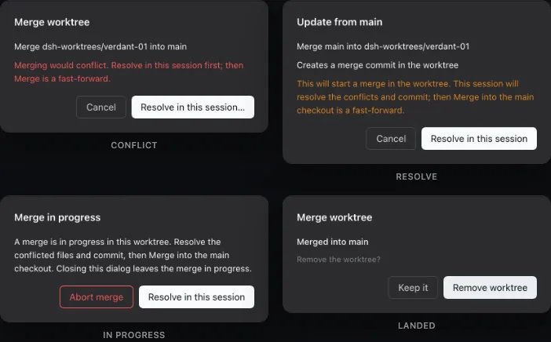
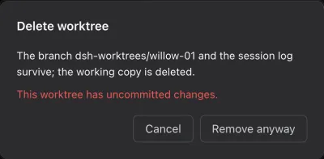
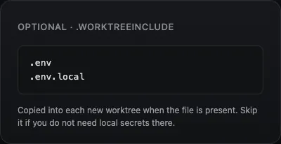

# worktrees

English | [中文](README.zh.md)

This DeepSeek Harness plugin lets two agents work on the same git repository
without overwriting each other. Each session gets its own folder and branch.
When the work is ready, `Merge…` copies those commits onto the branch you
have checked out in the main folder. If the branches would conflict, choose
`Resolve in this session` so this session's agent can fix the files first.



## How it works

1. In the sidebar, on the row for your git repo, click the branch icon
   (next to `+`). A new worktree opens as a session under that repo.
2. Do the work in that session. The main folder stays on its own branch.
3. When you are ready, open `Merge…`. The plugin checks first. If the
   branches would conflict, choose `Resolve in this session` — this session
   resolves the files and commits. Then Merge is a fast-forward.
4. Keep the worktree or remove it. The branch and the chat stay either way.



## Features

### Create

One click. The name is generated. A session opens in the new checkout.


### Status

The branch icon is the status: gray when clean, amber with uncommitted
changes, blue when this branch is ahead (with the commit count), green
when already merged, red when a merge is in progress.



### Row menu

The session `...` menu adds `Refresh` (re-read git status),
`Update from <branch>…` (bring that branch into this worktree),
`Merge…`, and `Delete worktree…`.



### Hover details

Hover a worktree session for its title, branch, and status.



### Merge and conflicts

`Merge…` checks that both sides are committed and that the merge would
succeed, then lands the worktree on your current branch. If it would
conflict, the next step is `Resolve in this session`: the plugin merges
the main branch *into the worktree* (never the other way), this session
fixes the files, and you Merge as a fast-forward. While a merge is in
progress the dialog offers `Abort merge`. Closing it leaves the merge in
the worktree; the main folder is untouched.



### Delete

Removes the extra folder. The branch and session log stay. A worktree
with uncommitted changes needs a second confirm (`Remove anyway`).



### Unused worktrees

A worktree you never started is removed when you switch to another
session. A worktree with uncommitted changes is never removed this way.

## Optional local files

A `.worktreeinclude` file is optional. If you commit one (one relative path
per line) at the repo root, each listed file is copied from your main
folder into **new** worktrees. Use it for local files git does not track,
such as `.env`. Missing files are skipped. It only copies files; it does
not run install commands.



## Setup commands (optional)

Clicking the branch icon to create a worktree already runs setup when
`.worktrees.json` is at the repo root (or `.dsh/worktrees.json` as a local
override). You do not click anything else. `$ROOT_WORKTREE_PATH` is the
main folder. A failed command cancels create and removes the extra folder.
Gitignored writes (`.env`, `node_modules`) do not count as uncommitted
changes. A file git can see (not ignored) does, and then Merge and Update
wait until you commit or delete it.

```json
{
  "setup-worktree": [
    "pnpm install",
    "cp \"$ROOT_WORKTREE_PATH/.env\" .env"
  ]
}
```

That `setup-worktree` list is enough. `setup-worktree-unix` and
`setup-worktree-windows` are optional, only when the commands differ by OS.
A string value is a script path relative to the JSON file. `.dsh/worktrees.json`
wins when both files exist.

## Install

```sh
dsh plugin --profile <name> add @dsh-next/dsh-next-worktrees
```

`<name>` is your DSH profile (for example `web`).

## Good to know

- Needs DeepSeek Harness `0.1.2-rc.1` or newer.
- Do not install alongside another plugin that replaces the sidebar.
- The plugin never writes commit messages. This session's agent does.
- Contributors: see [CONTRIBUTING.md](https://github.com/dsh-next/dsh-next-plugins/blob/main/CONTRIBUTING.md).
